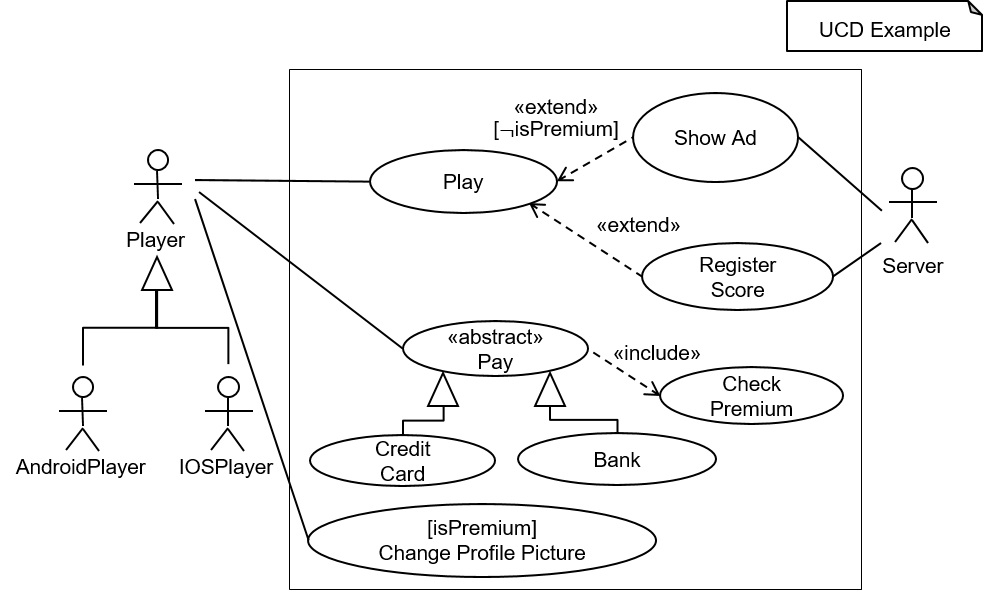

<!-- (c) https://github.com/MontiCore/monticore -->

This documentation is intended for  **modelers** who use the use case diagram (UCD) language.
A detailed documentation for **language engineers** using or extending the UCD language is 
located **[here](src/main/grammars/UCD.md)**.
We recommend that **language engineers** read this documentation before reading the detailed
documentation.

# Example Models


<br><b>Figure 1:</b> The graphical syntax of an example UCD.

&nbsp;  

Figure 1 depicts the UCD ```Example``` in graphical syntax. 
It contains all syntactic UCD elements supported by this MontiCore language.
In textual syntax, the UCD is defined as follows:

``` 
usecasediagram Example {
  @Player --
    Play,
    Pay,
    ChangeProfilePicture;

  @AndroidPlayer specializes Player;
  @IOSPlayer specializes Player;

  @Server --
    ShowAd,
    RegisterScore;

  ShowAd extend Play [!isPremium];
  RegisterScore extend Play;

  abstract Pay include CheckPremium;
  CreditCard specializes Pay;
  Bank specializes Pay;
  ChangeProfilePicture [isPremium];
}
```

# Grammar 
For a detailed description of the syntax of the language please consider reading the comments in 
the corresponding [UCD grammar](src/main/grammars/UCD.mc4).

# Command Line Interface (CLI)

This section describes the CLI tool of the UCD language. 
The CLI tool provides typical functionality used when
processing models. To this effect, it provides funcionality
for 
* parsing, 
* storing symbols in symbol files, and
* semantic differencing. 

The requirements for building and using the UCD CLI tool are that Java 8, Git, and Gradle are 
installed and available for use in Bash. 

The following subsection describes how to download the CLI tool.
Then, this document describes how to build the CLI tool from the source files.
Afterwards, this document contains a tutorial for using the CLI tool.  

## Downloading the Latest Version of the CLI Tool
A ready to use version of the CLI tool can be downloaded in the form of an executable JAR file.
You can use [**this download link**](http://monticore.de/download/UCDCLI.jar) 
for downloading the CLI tool. 

Alternatively, you can download the CLI tool using `wget`.
The following command downloads the latest version of the CLI tool and saves it under the name `UCDCLI` 
in your working directory:
```
wget "http://monticore.de/download/UCDCLI.jar" -O UCDCLI.jar
``` 

## Building the CLI Tool from the Sources
 
It is possible to build an executable JAR of the CLI tool from the source files located in GitHub.
The following describes the process for building the CLI tool from the source files using Bash.
For building an executable Jar of the CLI with Bash from the source files available
in GitHub, execute the following commands.

First, clone the repository:
```
git clone https://github.com/MontiCore/ucd.git
```
Change the directory to the root directory of the cloned sources:
```
cd ucd
```
Afterwards, build the source files with gradle:
```
./gradle build
```
Congratulations! You can now find the executable JAR file `UCDCLI.jar` in
 the directory `target/libs` (accessible via `cd target/libs`).

## Tutorial: Getting Started Using the UCD CLI Tool
The previous sections describe how to obtain an executable JAR file
(UCD CLI tool). This section provides a tutorial for
using the UCD CLI tool. The following examples assume
that you locally named the CLI tool `UCDCLI`.

### First Steps
Executing the Jar file without any options prints usage information of the CLI tool to the console:
```
java -jar UCDCLI.jar
usage: UCDCLI
 -h,--help                Prints this help informations.
 -i,--input <arg>         Processes the list of UCD input artifacts. Argument
                          list is space separated.
 -s,--symboltable <arg>   Stores the symbol tables of the input UCDs in the
                          specified files. The n-th input UCD is stored in the
                          file as specified by the n-th argument. Default is
                          'target/symbols/{packageName}/{artifactName}.ucdsym'.
 -sd,--semdiff            Computes a diff witness showing the asymmetrical
                          semantic difference of two UCDs. Requires two UCDs as
                          inputs. See se-rwth.de/topics for scientific
                          foundation.

```
To work properly, the CLI tool needs the mandatory argument `-i,--input <arg>`, which takes the file paths of at least one input file containing UCD models.
If no other arguments are specified, the CLI tool solely parses the model(s).

For trying this out, copy the `UCDCLI.jar` into a directory of your choice. 
Afterwards, create a text file containing the following simple UCD:
```
usecasediagram Example {
}
```

Save the text file as `Example.ucd` in the directory where `UCDCLI.jar` is located. 

Now execute the following command:
```
java -jar UCDCLI.jar -i Example.ucd
```

You may notice that the CLI tool prints no output to the console.
This means that the tool has parsed the file `Example.ucd` successfully.

### Step 2: Storing Symbols
Create a new file and name it ````Example.ucd````. Copy the textual representation of the UCD presented in the 
example section above into the file. Place the file in the same directory is the ````UCDCLI.jar```` you are using.

Now, we will use the CLI tool to store a symbol file for our `Example.ucd` model.
The stored symbol file will contain information about the use cases and actors defined in the UCD.
It can be imported by other models for using the symbols.

Using the `-s,-symboltable <arg>` option builds the symbol tables of the input models and stores them in the file paths given as arguments.
Either no file paths must be provided or exactly one file path has to be provided for each input model.
The symbol file for the i-th input model is stored in the file defined by the i-th file path. 
If you do not provide any file paths, the CLI tool stores the symbol table of each input model 
in the symbol file `target/symbols/{packageName}/{fileName}.ucdsym` 
where `packageName` is the name of the package as specified in the file containing 
the model and `fileName` is the name of the file containing the model. The file is stored relative 
to the working directory, i.e., the directory in which you execute the command for storing the symbol files.

For storing the symbol file of `Example.ucd`, execute the following command:
```
java -jar UCDCI.jar -i Example.ucd -s
```
The CLI tool produces the file `target/symbols/Example.ucdsym`, which can now be imported by other models, e.g., by models that need to
use some of the use cases and actors defined in the UCD `Example`.

For storing the symbol file of `Example.ucd` in the file `syms/Example.mysym`, for example, execute the following command:
```
java -jar UCDCLI.jar -i Example.ucd -s syms/Example.mysym
```

Congratulations, you have just finished the tutorial about saving UCD symbol files!

### Step 3: Semantic Differencing

Semantic differencing of UCDs enables developers to detect differences in the meanings of the UCDs.
The semantic difference from an UCD `ucd1` to an UCD `ucd2` is defined as the set of all scenarios 
that are valid in `ucd1` and not valid in `ucd2`. A scenario consists of a variable assignment, use cases,
actors and a relation relating the actors to use cases contained in the scenario. 
A scenario represents that the use cases are executed by the actors according to the relation under 
the circumstances defined by the variable assignment. The semantics of an UCD is the set of scenarios 
explicitly described by the UCD.
 
In this section, we consider the UCDs [SwimmyFish1.ucd](src/test/resources/semdiff/SwimmyFish1.ucd) and 
[SwimmyFish2.ucd](src/test/resources/semdiff/SwimmyFish2.ucd).
Download the files containing the UCDs (by using the links) and place them in the directory where the CLI tool `UCDCLI.jar`
is located. The file located [here](src/test/resources/semdiff/SwimmyFish1.ucd) should be named `SwimmyFish1.ucd` and the file 
located [here](src/test/resources/semdiff/SwimmyFish2.ucd) should be named `SwimmyFish2.ucd`.

To calculate an element contained in the semantic difference from an UCD to another UCD, 
the CLI tool provides the `-sd,--semdiff` option.
For example, to calculate an element contained in the semantic difference from
the UCD defined in the file `SwimmyFish1.ucd` to the UCD defined in the file `SwimmyFish2.ucd`, execute 
the following command:

```
java -jar UCDCLI.jar -sd -i SwimmyFish1.ucd SwimmyFish2.ucd
```

The CLI prints the scenarios that are possible in ```SwimmyFish1``` nad not possible in ```SwimmyFish2```.
The following shows an excerpt of the output:
```
scenario {
  Statisfied variables: [isPremium, gameFinished]
  Use cases: [ShowAd, Play, RegisterScore]
  @Server--[ShowAd, RegisterScore]
  @Player--[Play]
}
```

The excerpt defines a scenario 
* containing the use cases `ShowAd`, `Play`, and `RegisterScore`,
* containing the actors `Server` and `Player`,
* containing associations between `Server` and `ShowAd`, `Server` and `RegisterScore` as well as `Player` and `Play`,  
* assigning the value `true` exactly to the two variables `isPremium` and `gameFinished`.

The semantic difference operator is by no means commutative, swapping the arguments changes the result.
Execute the following command:
```
java -jar UCDCLI.jar -sd -i SwimmyFish2.ucd SwimmyFish1.ucd
```

This yield the following output:
```
The input UCD 'SwimmyFish2.ucd' is a refinement of the input UCD 'SwimmyFish1.ucd'
```

In this case, the CLI tool outputs that the UCD `SwimmyFish2.ucd` is a refinement of the UCD 
`SwimmyFish1.ucd`. This means that all scenarios of the UCD `SwimmyFish2` are 
also scenarios of the UCD `SwimmyFish1`. Thus, the semantic difference from `SwimmyFish2` to `SwimmyFish1` is empty.

You finished the tutorial on semantic UCD differencing and are now ready to execute 
semantic evolution analysis via semantic differencing for arbitrary UCDs. Great!

## Further Information

* [Project root: MontiCore @github](https://github.com/MontiCore/monticore)
* [MontiCore documentation](http://www.monticore.de/)
* [**List of languages**](https://github.com/MontiCore/monticore/blob/dev/docs/Languages.md)
* [**MontiCore Core Grammar Library**](https://github.com/MontiCore/monticore/blob/dev/monticore-grammar/src/main/grammars/de/monticore/Grammars.md)
* [Best Practices](https://github.com/MontiCore/monticore/blob/dev/docs/BestPractices.md)
* [Publications about MBSE and MontiCore](https://www.se-rwth.de/publications/)
* [Licence definition](https://github.com/MontiCore/monticore/blob/master/00.org/Licenses/LICENSE-MONTICORE-3-LEVEL.md)

