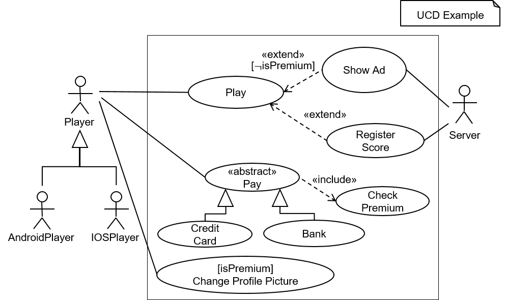

<!-- (c) https://github.com/MontiCore/monticore -->
<!-- This is a MontiCore stable explanation. -->

This documentation is intended for **language engineers** using or extending
the use case diagram (UCD) language. 
A detailed documentation for **modelers** who use the UCD language is 
located **[here](../../../README.md)**. We recommend that **language engineers** 
read this documentation for **modelers** before reading the other documentation.

# Use Case Diagrams 
The module described in this document defines a MontiCore language for 
UCDs. 
                    
This module contains 
* one grammar and
* a generated symbol table infrastructure including functionality for 
  creating symbol tables and (de-)serializing symbol tables. 

## An Example Model


<br><b>Figure 1:</b> The graphical syntax of an example UCD.

&nbsp;  

Figure 1 depicts the UCD ```Example``` in graphical syntax. 
It contains all syntactic UCD elements supported by this MontiCore language.
In textual syntax, the UCD is defined as follows:

``` 
usecasediagram Example {
  @Player --
    Play,
    Pay,
    ChangeProfilePicture;

  @AndroidPlayer specializes Player;
  @IOSPlayer specializes Player;

  @Server --
    ShowAd,
    RegisterScore;

  ShowAd extend Play [!isPremium];
  RegisterScore extend Play;

  abstract Pay include CheckPremium;
  CreditCard specializes Pay;
  Bank specializes Pay;
  ChangeProfilePicture [isPremium];
}
```

## Command Line Interface (CLI) Usage

The class [```UCDCLI```](../java/ucd/UCDCLI.java)
provides typical functionality used when
processing models. To this effect, the class provides methods
for parsing, creating symbol tables, storing symbols, and 
loading symbols. 

The class provides a `main` method and can thus be used as a CLI. Building this gradle project yields 
the executable jar `UCDCLI`, which can be found
in the directory `target/libs`. The usage of the `UCDCLI` tool and detailed instructions
for building the took from the source files are described **[here](../../../README.md)**. 

## Grammars

This module contains the grammar [UCD.mc4](UCD). 

### UCD
The grammar [UCD](UCD.mc4) contains the basic constituents to define textual 
representations of UCDs. A detailed documentation of the grammar can 
be found in the [artifact defining the grammar](UCD.mc4). 

The grammar defines the syntax for 
* UCD artifacts, 
* UCDs, 
* use cases, 
* actors, and
* include and extend relations.   
                            
The grammar extends the grammars
* [MCBasicTypes][MCBasicTypesRef] for reusing package declarations and import statements.
* [CommonExpressions][CommonExpressionsRef] to be able to use boolean expressions, e.g., a && b.
* [MCCommonLiterals][MCCommonLiteralsRef] to be able to use boolean literals in expressions.

## Context Conditions

There are not context conditions for the language.

## Symbol Table

The UCD language defines the symbol kinds `UCDUseCaseSymbol` and `UCDActorSymbol`. 
UCD export instances of these symbol kinds. 
UCDs do not import any symbols.
The language uses the symbol table infrastructure generated by MontiCore as it is without handwritten modifications.

### Symbol Table Data Structure

The `UCDGlobalScope` contains `UCDArtifactScopes`. Each `UCDArtifactScope` instance contains exactly one `DiagramSymbol` for the UCD.
Further, each `UCDArtifactScope` instance contains exactly one `UCDUseCaseSymbol` for each use case defined in the UCD and one 
`UCDActorSymbol` for each actor defined in the UCD. 


## Symbol kinds used by the UCD language (importable or subclassed):
The language does not reuse any symbol kinds. It only uses the symbol kinds defined by the language.

## Symbol kinds defined by the UCD language (exported):
`UCDUseCaseSymbol` for use cases and `UCDActorSymbol` for actors.     

## Symbols imported by UCD models:
none.

## Symbols exported by UCD models:
Each `UCDArtifactScope` instance contains exactly one `UCDUseCaseSymbol` for each use case defined in the UCD and one 
`UCDActorSymbol` for each actor defined in the UCD. 

## Serialization and De-serialization of Symbol Tables
The DeSers generated by MontiCore are not changed by any handwritten modifications.

[BasicSymbolsRef]:https://github.com/MontiCore/monticore/blob/dev/monticore-grammar/src/main/grammars/de/monticore/symbols/BasicSymbols.mc4
[TypeSymbolsRef]:https://github.com/MontiCore/monticore/tree/dev/monticore-grammar/src/main/grammars/de/monticore/types
[MCBasicTypesRef]:https://git.rwth-aachen.de/monticore/monticore/-/blob/dev/monticore-grammar/src/main/grammars/de/monticore/types/MCBasicTypes.mc4
[OOSymbolsRef]:https://github.com/MontiCore/monticore/blob/dev/monticore-grammar/src/main/grammars/de/monticore/symbols/OOSymbols.mc4
[ExpressionsBasisRef]:https://github.com/MontiCore/monticore/blob/dev/monticore-grammar/src/main/grammars/de/monticore/expressions/ExpressionsBasis.mc4
[UMLStereotypeRef]:https://github.com/MontiCore/monticore/blob/dev/monticore-grammar/src/main/grammars/de/monticore/UMLStereotype.mc4
[MCCommonLiteralsRef]:https://github.com/MontiCore/monticore/blob/dev/monticore-grammar/src/main/grammars/de/monticore/literals/MCCommonLiterals.mc4
[CommonExpressionsRef]:https://github.com/MontiCore/monticore/blob/dev/monticore-grammar/src/main/grammars/de/monticore/expressions/CommonExpressions.mc4
[OCLExpressionsRef]:https://git.rwth-aachen.de/monticore/languages/OCL/-/blob/develop/src/main/grammars/de/monticore/ocl/OCLExpressions.mc4

## Further Information

* [Project root: MontiCore @github](https://github.com/MontiCore/monticore)
* [MontiCore documentation](http://www.monticore.de/)
* [**List of languages**](https://github.com/MontiCore/monticore/blob/dev/docs/Languages.md)
* [**MontiCore Core Grammar Library**](https://github.com/MontiCore/monticore/blob/dev/monticore-grammar/src/main/grammars/de/monticore/Grammars.md)
* [Best Practices](https://github.com/MontiCore/monticore/blob/dev/docs/BestPractices.md)
* [Publications about MBSE and MontiCore](https://www.se-rwth.de/publications/)
* [Licence definition](https://github.com/MontiCore/monticore/blob/master/00.org/Licenses/LICENSE-MONTICORE-3-LEVEL.md)

